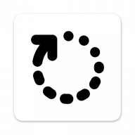

 

<h1 align="center">Update Me</h1>

&nbsp;

  
  
  

&nbsp;

 
 

&nbsp;

  
    
    
    

&nbsp;

<h3 align="center">Download and Install Modded Apps</h3>

Access a wide range of modded apps tailored for Android devices with ease.

<h3 align="center">Multiple Versions and Modders</h3>

Choose your preferred version and modder from a variety of sources to find the perfect modded app for your needs.

<h3 align="center">Update Notifications</h3>

Stay informed with notifications when updates are available for your selected apps and providers, ensuring you always have the latest features and improvements

<h3 align="center">Regularly Updated Library</h3>

Enjoy a constantly refreshed collection of the best and most popular modded apps available online.

<h3 align="center">Troubleshooting and Advice Tips</h3>

Access troubleshooting and advice tips to help resolve any issues and enhance your app experience.

<h3 align="center">Suggest Apps to be Featured</h3>

Have the ability to suggest apps to be featured, helping to expand and improve the app library.

<h3 align="center">Styled with Material Design</h3>

Experience a modern and intuitive design with Material Design, providing a clean and user-friendly interface.

<h3 align="center">Built with React Native</h3>

Experience a smooth, responsive, and user-friendly interface, thanks to the app being built with React Native.

<h3 align="center">Virus and Security Checks</h3>

Rest assured that all APKs are thoroughly scanned for viruses and security threats, ensuring safe downloads.

<h3 align="center">Secure and Licensed</h3>

Licensed under the Apache License 2.0, the app ensures flexibility, security, and reliability for all users.

&nbsp;

<h2 align="center">User Permissions</h2>

|                 Permission | Description                                                                                                |
| -------------------------: | ---------------------------------------------------------------------------------------------------------- |
|                 `INTERNET` | Allows the app to access the internet to fetch updated app repositories.                                   |
|     `ACCESS_NETWORK_STATE` | Allows the app to check network connectivity status to determine if it can fetch updated app repositories. |
| `REQUEST_INSTALL_PACKAGES` | Allows the app to request the installation of downloaded APKs when the user decides to install them.       |
|  `REQUEST_DELETE_PACKAGES` | Allows the app to request the deletion of downloaded APKs when the user decides to delete them.            |
|       `QUERY_ALL_PACKAGES` | Allows the app to query all installed packages to verify if the app is installed and up-to-date.           |
|                  `VIBRATE` | Allows the app to vibrate the device when a notification is received.                                      |
|       `POST_NOTIFICATIONS` | Allows the app to send notifications to the user when updates are available.                               |
|   `RECEIVE_BOOT_COMPLETED` | Allows the app to detect when the device is restarted to check for updates in the background.              |

